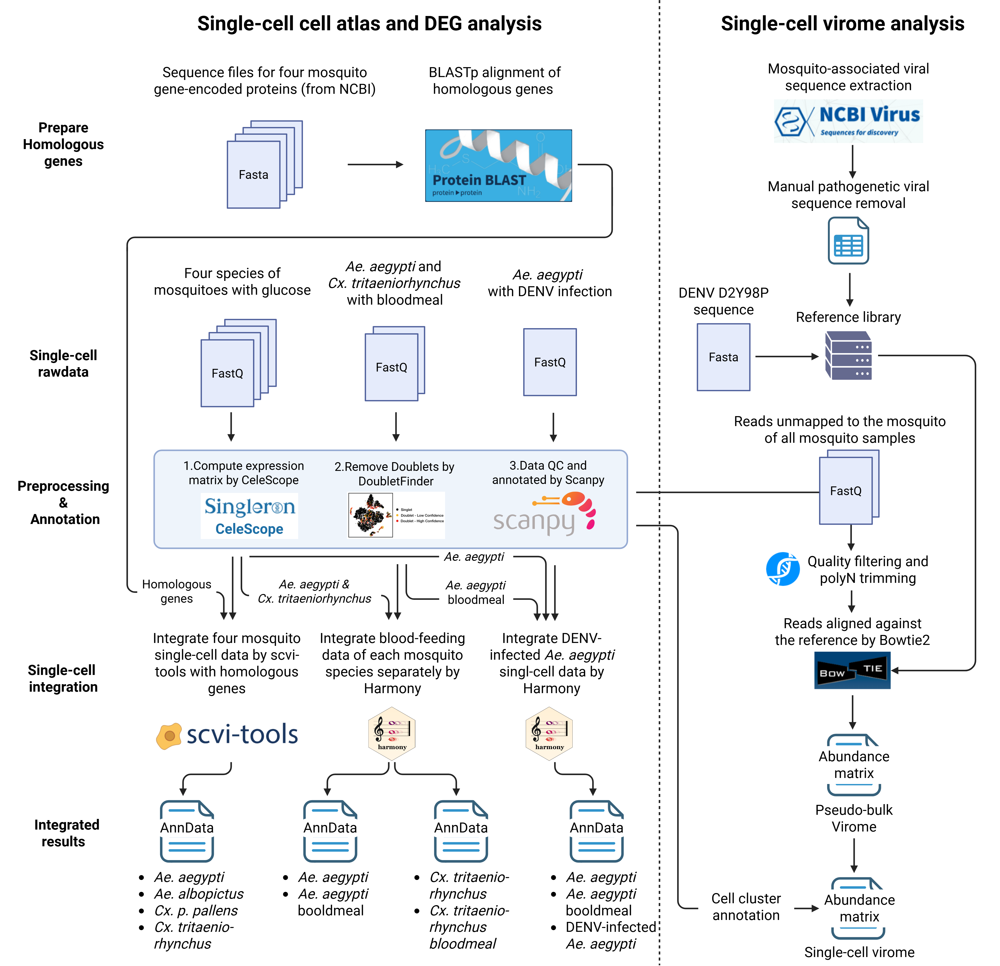

# Midgut cell atlas and virome of mosquito project
Codes for midgut cell atlas and virome of mosquito project.

## scRNA analysis process
- **matrix_generation/** read raw sequencing data and generate 10x matrix files and bam files with unmapped reads.
- **replot_mosq/** The QC and annotation process of each sample. DEG analysis for four mosquitoes.
- **merge_4mosq/** The analysis of four mosuqitoes by cross-species integrated data by scvi.
- **merge_bl_harmony/** The merge and DEG analysis of *Ae. aegypti* and *Cx. tritaeniorhynchus* pre- and post-bloodmeal, respectively.
- **denv_mosq/** The merge and DEG analysis of DENV-infected *Ae. aegypti* by integrating the other data of bloodmeal and non-infectious bloodmeal.

## Virome analysis process
- **Abundance generation/** The generation of viral abundance matrix and pseudo-bulk virome analysis.
- **Others** The analysis of single-cell virome.
## Workflow
